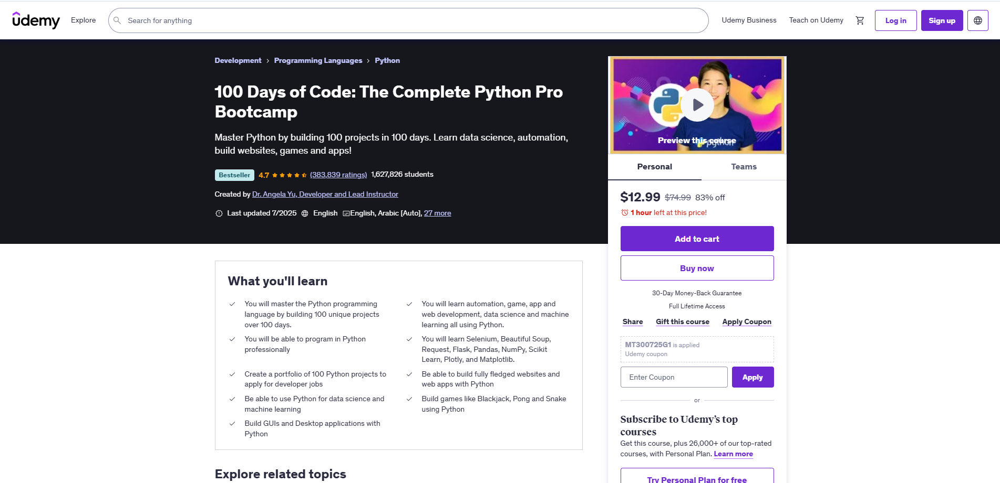

# 100 Days of Code: Python

This repository contains my progress and projects for the "100 Days of Code: Python" course on Udemy. The course is designed to help beginners learn Python programming through a unique 100-day coding challenge.

## Table of Contents

- [About the Course](#about-the-course)
- [Projects](#projects)
- [Resources](#resources)
- [Usage](#usage)
- [Contributing](#contributing)
- [License](#license)

## About the Course

The "100 Days of Code: Python" course is an intensive coding challenge that focuses on building Python programming skills through practical exercises and projects. The course covers a wide range of topics, including:

- Python fundamentals (data types, control flow, functions)
- Object-Oriented Programming (OOP)
- File handling
- Web development with Python (Flask, APIs)
- Data analysis and visualization (NumPy, Pandas, Matplotlib)
- GUI development (Tkinter)
- and more!

## Projects

This repository will showcase various projects developed during the course, ranging from simple scripts to more complex applications. Each project will have inside the dedicated directory of the day in which I created it with source code and comments explaining its purpose and functionality.
Some of the projects that will be part of this 100 days journey :

- Blackjack
- Snake Game
- Pong Game
- Auto Swipe on Tinder
- Auto Job Applications on LinkedIn
- Automate Birthday Emails/SMS
- Fully Fledged Blog Website
- Build Your Own Public API
- Data Science with Google Trends
- Analysing Lego Datasets
- Google App Store Analysis
and much much more!

## Resources

- [Course Link](https://www.udemy.com/course/100-days-of-code/?couponCode=LEADERSALE24A)
- [Python Documentation](https://docs.python.org/3/)

## Usage

To run any of the projects or scripts in this repository, you'll need to have Python installed on your system. You can download the latest version of Python from the official website: [https://www.python.org/downloads/](https://www.python.org/downloads/)

Once you have Python installed, you can clone this repository and navigate to the desired project directory according to day number. Then, you can run the scripts or applications according to the instructions provided in the project's source code.

## Contributing

While this repository is primarily intended to showcase my personal progress and projects, contributions are welcome. If you find any issues or have suggestions for improvement, please feel free to open an issue or submit a pull request.

## License

This project is licensed under the [MIT License](LICENSE).
@anowarul_asif(immortal)